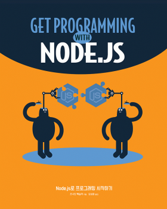

# Node.js and Express.js practice

## 1. Introduction



에이콘 출판사의 'Node.js로 프로그래밍 시작하기'를 참고해서 공부한 Node.js와 Express.js 코드를 정리한 곳입니다.

## 2. Usage

```bash
cd <dir name> 
npm install
node main 
```

## 3. Memo

### Lesson 13

```javascript
db.contacts.update({"name": "Jon"}, {"name": "Jon Wexler"})
```

첫번째 항목을 두번째 항목으로 업데이트한다. 다른 요소가 같이 있었더라도 뒤에 값만 남도록 업데이트된다. 

값을 바꾸거나 추가하기 위해서는 `$set` 등의 명령어를 사용한다. 

[Velopert님의 MongoDB 강좌 update() 메소드](https://velopert.com/545)

## 4. Errata

###  Lesson 3 

- p.70, p.71 

```javascript
message => messages 

message.js  => messages.js

printMessage.js => printMessages.js
```

### Lesson 4 

- p.83 

```bash
npm i http-status-code -S => npm i http-status-codes -S
```

### Lesson 10 

```ejs
<% include partials/navigation %>
```

책의 예제처럼 입력하면 `SyntaxError` 가 발생한다. 

```ejs 
<%- include ("partials/navigation") %>
```

책의 예제코드는 `ejs` 2 버전을 기준으로 한다. `ejs` 3 버전에서는 기존 방식을 삭제했다고 한다. 현재 `ejs`는 3 버전이기 때문에 위와 같이 바꿔 써야 에러가 나지 않는다. 

### Lesson 11

- p.167

```bash
npm install http-status-code --save => npm install http-status-codes --save
```

- p.169 

```javascript
(errors, ...) => (error, ...)
```

### Lesson 13

- p.193 

data 폴더 하위 폴더를 db 로 생성한다. 

경로는 bin 까지만 추가한다. (\mongod.exe 제외)

- p.196 

```bash
db.contacts.find => db.contacts.find()
```

- p.198 

```bash
show collection => show collections 

db.contacts.findOne => db.contacts.findOne()

db.contacts.delete(...) => db.contacts.remove(...)
```

- p.200

```ba
:// localhost => ://localhost

err => error 
```

`{ useUnifiedTopology: true }` 를 추가해야 `DeprecationWarning`이 뜨지 않음 

### Lesson 14

- p.209

```javascript
model => models 

Model => models 
```

- p.211

Cread => Create

### Lesson 15

- p.216 

```javascript
: subscribers => : req.data 
```


